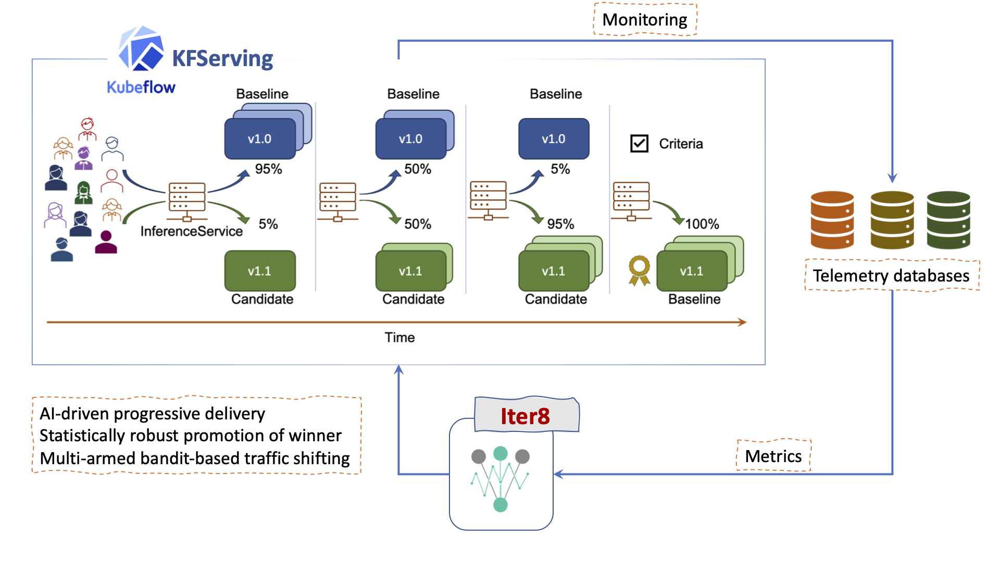

# Iter8-kfserving
> Iter8-kfserving enables metrics-driven live experiments, progressive delivery, and automated rollouts for ML models in production over Kubernetes and OpenShift clusters.

The picture below illustrates progressive canary release of a KFServing model using iter8-kfserving.



## Table of Contents
- [Quick start on Minikube](#Quick-start-on-Minikube)
- [Installation](./docs/installation.md)
- [Anatomy of an iter8 experiment](./docs/experimentanatomy.md)
- [Progressive canary release experiment](./docs/canary.md)
- [Describe experiments using iter8ctl](./docs/iter8ctl.md)
- Iter8 metrics
  * [Using metrics in experiments](./docs/usingmetrics.md)
  * [Out-of-the-box metrics](./docs/metrics_ootb.md)
  * [Anatomy of iter8 metrics](./docs/metricsanatomy.md)
  * [Defining a custom metric](./docs/metrics_custom.md)
- [Concurrent experiments](./docs/concurrency.md)
- Reference
  * [Experiment resource object](./docs/experimentcrd.md)
  * [Metric resource object](./docs/metricscrd.md)
- [Wiki with roadmap and developer documentation](https://github.com/iter8-tools/iter8-kfserving/wiki)
- [Contributing](./docs/contributing.md)

## Quick start on Minikube
Steps 1 to 7 demonstrate metrics-driven progressive canary release of a KFServing model using iter8-kfserving. 

Before you begin, you will need [Minikube](https://minikube.sigs.k8s.io/docs/start/), [Kustomize v3](https://kubectl.docs.kubernetes.io/installation/kustomize/), and [Go 1.14+](https://golang.org/doc/install).

**Step 1:** Start Minikube with sufficient resources.
```shell
minikube start --cpus 4 --memory 12288 --kubernetes-version=v1.17.11 --driver=docker
```

**Step 2:** Install KFServing, kfserving-monitoring, and iter8-kfserving.
```shell
curl -L https://raw.githubusercontent.com/iter8-tools/iter8-kfserving/main/samples/quickstart/platformsetup.sh | /bin/bash
```

**Step 3:** *In a separate terminal,* setup Minikube tunnel. If prompted, enter password.
```shell
minikube tunnel --cleanup
```

**Step 4:** Create a KFServing inferenceservice with a `default` model. Update it with a `canary` model. This step may take a couple of minutes.
```shell
curl -L https://raw.githubusercontent.com/iter8-tools/iter8-kfserving/main/samples/quickstart/inferenceservicesetup.sh | /bin/bash
```

**Step 5:** *In a separate terminal,* generate prediction requests for the inferenceservice.

**Install** [fortio](https://github.com/fortio/fortio). You can change the directory where `fortio` binary is installed by changing GOBIN below.
```shell
GOBIN=/usr/local/bin go get github.com/fortio/fortio
```

Generate prediction requests.
```shell
curl -L https://raw.githubusercontent.com/iter8-tools/iter8-kfserving/main/samples/quickstart/predictionrequests.sh | /bin/bash
```

**Step 6:** Create the iter8-kfserving canary experiment.
```shell
kubectl apply -f https://raw.githubusercontent.com/iter8-tools/iter8-kfserving/main/samples/quickstart/experiment.yaml
```
<details>
In this step, you are creating an iter8 experiment resource object in the Kubernetes cluster, which looks as follows.
<pre>
apiVersion: iter8.tools/v2alpha1
kind: Experiment
metadata:
  name: experiment-1
spec:
  target: default/my-model
  strategy:
    type: Canary
  criteria:
    indicators:
    - 95th-percentile-tail-latency
    objectives:
    - metric: mean-latency
      upperLimit: 1000
    - metric: error-rate
      upperLimit: "0.01"
  duration:
    intervalSeconds: 15
    maxIterations: 12
</pre>
This experiment spec asks iter8 to perform a <code>canary release experiment</code> for the inferenceservice named <code>my-model</code> in the <code>default</code> namespace; during the experiment, the default and canary model versions will be assessed every 15 seconds over 12 iterations; when the experiment experiment, the canary version will be considered successful (<code>winner</code>) if its mean-latency is within 1000 msec and its error rate is within 1%. If canary is successful, it will be rolled out: i.e., 100% of the traffic will be shifted to the canary.
</details>


**Step 7:** *In a separate terminal,* periodically describe the experiment.

**Install** [iter8ctl](https://github.com/iter8-tools/iter8ctl). You can change the directory where `iter8ctl` binary is installed by changing GOBIN below.
```shell
GOBIN=/usr/local/bin go get github.com/iter8-tools/iter8ctl@v0.1-alpha
```

Periodically describe the experiment.
```
while clear; do
  kubectl get experiment experiment-1 -o yaml | iter8ctl describe -f -
  sleep 15
done
```

You should see output similar to the following.
```shell
******
Experiment name: experiment-1
Experiment namespace: default
Experiment target: default/my-model

******
Number of completed iterations: 10

******
Winning version: canary

******
Objectives
+--------------------------+---------+--------+
|        OBJECTIVE         | DEFAULT | CANARY |
+--------------------------+---------+--------+
| mean-latency <= 1000.000 | true    | true   |
+--------------------------+---------+--------+
| error-rate <= 0.010      | true    | true   |
+--------------------------+---------+--------+

******
Metrics
+--------------------------------+---------+---------+
|             METRIC             | DEFAULT | CANARY  |
+--------------------------------+---------+---------+
| request-count                  | 132.294 |  73.254 |
+--------------------------------+---------+---------+
| 95th-percentile-tail-latency   | 298.582 | 294.597 |
| (milliseconds)                 |         |         |
+--------------------------------+---------+---------+
| mean-latency (milliseconds)    | 229.529 | 230.090 |
+--------------------------------+---------+---------+
| error-rate                     |   0.000 |   0.000 |
+--------------------------------+---------+---------+
```

The experiment should complete after 12 iterations (~3 mins). Once the experiment completes, inspect the InferenceService object. 
```shell
kubectl get isvc/my-model
```

You should see 100% of the traffic shifted to the canary model, similar to the below output.
```
# output of the above command should be similar to the below
NAME       URL                                   READY   PREV   LATEST   PREVROLLEDOUTREVISION   LATESTREADYREVISION                AGE
my-model   http://my-model.default.example.com   True           100                              my-model-predictor-default-zwjbq   5m
```
