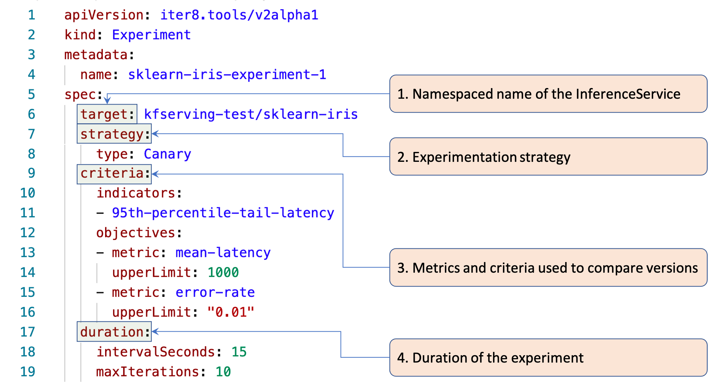

## Anatomy of an iter8 Experiment

> In experiments such as Canary, A/B and A/B/n that involve two or more versions, iter8 identifies a `winner` based on the experiment criteria. Typically, traffic shifts progressively towards the winner during the experiment, and it is promoted at the end.

The key elements of an iter8 experiment, taken from [this sample experiment manifest](../samples/experiments/example1.yaml), are illustrated in the following picture.

1. **Target** refers to the InferenceService object used in this experiment. It is a specified using the `namespace/name` format.

2. **Strategy** refers to the strategy used in this experiment. Currently, iter8-kfserving supports Canary experiments. Other experiment types such as BlueGreen, A/B and A/B/n rollouts are part of the [roadmap](roadmap.md).

3. **Criteria** refers to the metrics and criteria used to evaluate the model versions.

4. **Duration** specifies the number of iterations within the experiment, and the duration of each iteration (in seconds).
