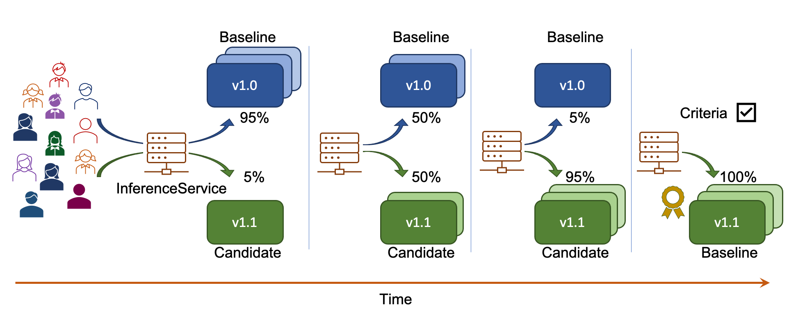
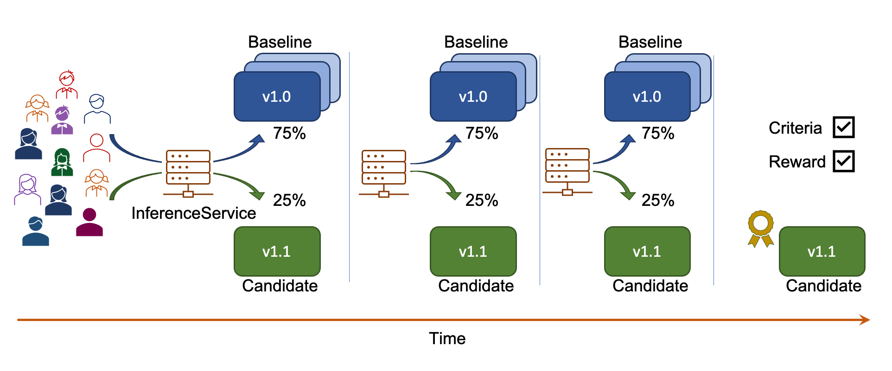

# Iter8-kfserving Overview

[KFServing](https://github.com/kubeflow/kfserving) enables serverless inferencing on [Kubernetes](https://kubernetes.io) and [OpenShift](https://www.openshift.com). [Iter8](https://iter8.tools) enables metrics-driven release automation for Kubernetes and OpenShift applications. This package brings the two projects together and enables metrics-driven release automation of KFServing models on Kubernetes and OpenShift.

## Experimentation Overview

Iter8-kfserving supports **four** basic experimentation strategies, namely, *Canary*, *A/B*, *BlueGreen* and *Performance*. The first three strategies involve comparing two model versions while the last strategy involves testing a single model version. 

### Canary, A/B, BlueGreen and Performance experiments

**Canary:**  In a Canary experiment, there is a baseline version (default predictor) and a candidate version (canary predictor). If the candidate version satisfies the `experiment criteria`, then it is declared as the `winner`. Otherwise, baseline is declared as the winner.

**A/B:**  In an A/B experiment, there is a baseline version and a candidate version.

Candidate is the winner if:
1. Candidate satisfies the experiment criteria and baseline does not, or
2. Candidate satisfies the experiment criteria and has a better `reward` than baseline.

Baseline is the winner if:
1. Baseline satisfies the experiment criteria and candidate does not, or
2. Baseline satisfies the experiment criteria and has a better reward than candidate.

A/B experiments can end without a winner being found (for instance, when both baseline and candidate fails to satisfy the experiment criteria).

**BlueGreen:**  In a BlueGreen experiment, there is a baseline version and a candidate version. All traffic flows to the candidate during the experiment. If candidate fails to satisfy the experiment criteria at any point during the experiment, then the experiment ends immediately and the baseline version is restored.

**Performance:**  In a Performance experiment, there is a single version (baseline). The experiment checks if the baseline satisfies the criteria or not.

### Customization
In general, an iter8-kfserving experiment can be customized along the following three dimensions.

1. Traffic split during the experiment
    * fixed: traffic split is held fixed between the two model versions during the experiment
    * progressive: traffic split is progressively shifted towards the *winner* (see the `Examples` section below)
2. Behavior when candidate (canary version) fails experiment criteria during the experiment
    * end experiment immediately
    * no-op
3. End-of-experiment behavior
    * promote winner: InferenceService with the winning version as the baseline (default version) is applied.
    * it push winner: InferenceService with the winning version as the baseline is git pushed.
    * rollback: InferenceService at the start of the experiment is restored
    * no-op

### Examples of iter8-kfserving experiments
The following examples illustrate a few iter8 experiment scenarios.

#### Progressive canary rollout
This figure illustrates a progressive canary rollout experiment. In this example, candidate satisfies the experiment criteria and is declared the winner at the end of the experiment; traffic is progressively shifted from baseline to candidate during the experiment, and candidate is promoted as the new baseline at the end of the experiment.

You can exercise this example using [this sample experiment object](../samples/experiments/progressivecanaryrollout.yaml).

#### Fixed-split A/B testing
This figure illustrates a fixed-split A/B testing experiment. In this scenario, candidate satisfies the experiment criteria, has a better reward compared to the baseline, and is declared the winner at the end of the experiment; traffic split is fixed throughout the experiment.

You can exercise this scenario using [this sample experiment object](../samples/experiments/fixedsplitabtest.yaml).

#### Progressive A/B rollout with Git push
The following figure illustrates a progressive A/B rollout experiment with Git push. In this scenario, candidate satisfies the experiment criteria, has a better reward compared to the baseline, and is declared the winner at the end of the experiment; traffic is progressively shifted from baseline to candidate during the experiment, and a new InferenceService yaml with the candidate as the default model version is Git pushed.

You can exercise this scenario using [this sample experiment object](../samples/experiments/progressiveabrolloutwithgitpush.yaml).

#### BlueGreen deployment
The following figure illustrates a BlueGreen deployment experiment. In this scenario, candidate satisfies the experiment criteria and is declared the winner at the end of the experiment; all traffic is sent to the candidate during the experiment, and candidate is promoted as the new baseline at the end of the experiment. 

You can exercise this scenario using [this sample experiment object](../samples/experiments/bluegreendeployment.yaml).

#### Performance testing
The following figure illustrates a performance testing experiment. In this scenario, the baseline satisfies the experiment criteria.

You can exercise this scenario using [this sample experiment object](../samples/experiments/performancetest.yaml).

## Metrics

Iter8-kfserving package ships with fourteen "out-of-the-box" metrics, which are described in the following table. You can extend this set by defining custom metrics. Each metric is defined at a per-version level. For example, the `request-count` metric measures the number of requests to a model version; the `mean-latency` metric measures the mean latency of a model version. Metrics can be of type `counter` or `gauge`. They are inspired by [Prometheus counter metric type](https://prometheus.io/docs/concepts/metric_types/#counter) and [Prometheus gauge metric type](https://prometheus.io/docs/concepts/metric_types/#gauge).

|Name   |Description    |Type   |Units  |
|---    |----           |---    |---    |
|request-count  | Number of requests      | counter   |    |
|mean-latency   | Mean latency    | gauge      | milliseconds |
|95th-percentile-tail-latency   | 95th percentile tail latency    | gauge      | milliseconds |
|error-count   | Number of error responses    | counter      |  |
|error-rate   | Fraction of requests with error responses    | gauge      |  |
|container-throttled-seconds-total   | Total time duration the container has been throttled    | counter      | seconds |
|container-cpu-load-average-10s   | Value of container cpu load average over the last 10 seconds    | gauge      | |
|container-fs-io-time-seconds-total   | Cumulative count of seconds spent doing I/Os    | counter      | seconds |
|container-memory-usage-bytes   | Current memory usage, including all memory regardless of when it was    | gauge      | bytes |
|container-memory-failcnt   | Number of times memory usage hit resource limit    | counter      | |
|container-network-receive-errors-total   | Cumulative count of errors encountered while receiving    | counter      | |
|container-network-transmit-errors-total   | Cumulative count of errors encountered while transmitting    | counter      | |
|container-processes   | Number of processes running inside the container    | gauge      | |
|container-tasks-state   | Number of tasks in given state (sleeping, running, stopped, uninterruptible, or ioawaiting)    | gauge      | |
