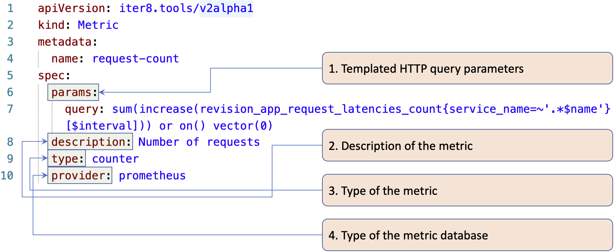
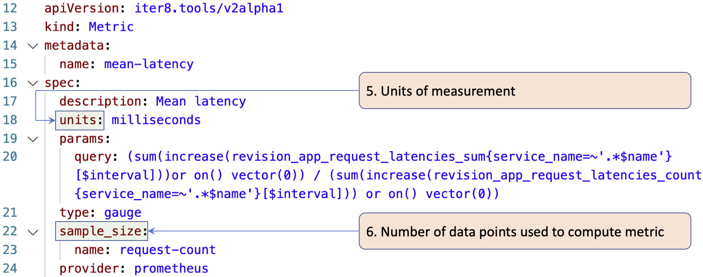

## Anatomy of iter8 Metrics

> Iter8 metrics can be of two types: `counter` or `gauge`. The value of a counter metric is non-decreasing over time, while a gauge metric value can increase or decrease at any point in time. 

> During an experiment, iter8 gets the metric values by querying metric databases using HTTP queries. Iter8 instantiates the parameters of these HTTP queries using templated HTTP query parameters specified as part of metric definitions.

The main elements of iter8 metrics are illustrated in the following two examples.

---

---

### Description of keys highlighted above

**`params`:** templated HTTP query parameters; `params` are instantiated by iter8 before querying metrics databases. More details are available [here](metrics_custom.md#example-1-defining-a-counter-metric).

**`description`:** human-readable description of the metric.

**`type`:** `counter` or `gauge`. More details about defining metrics of these types are available [here](metrics_custom.md).

**`provider`:** type of the metric database. Currently, `prometheus` is the only supported provider. Support for other providers is part of the [roadmap](https://github.com/iter8-tools/iter8-kfserving/wiki/Roadmap).

**`units`:** unit of measurement for the metric; some metrics (such as `request_count` above) may not have units.

**`sample_size`:** number of data points over which the metric is computed. Specified in the `namespace/name` format or the `name` format. This field applies only to `gauge` metrics. More details are available [here](metrics_custom.md#example-3-defining-a-gauge-metric).